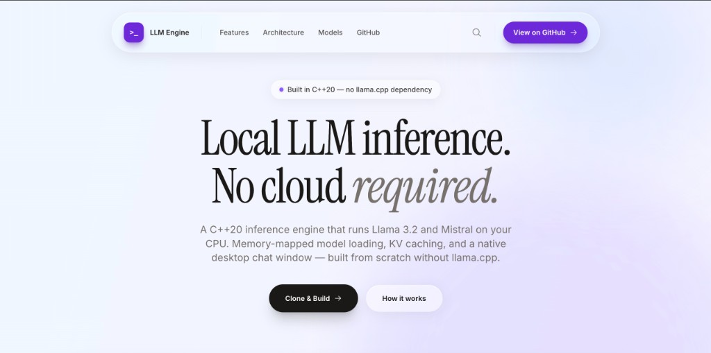
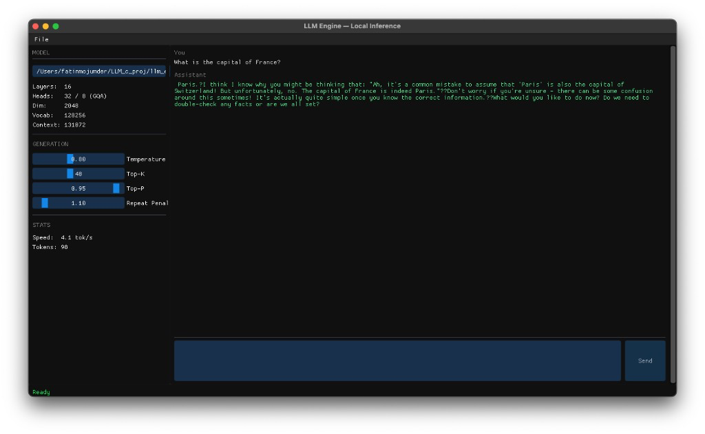
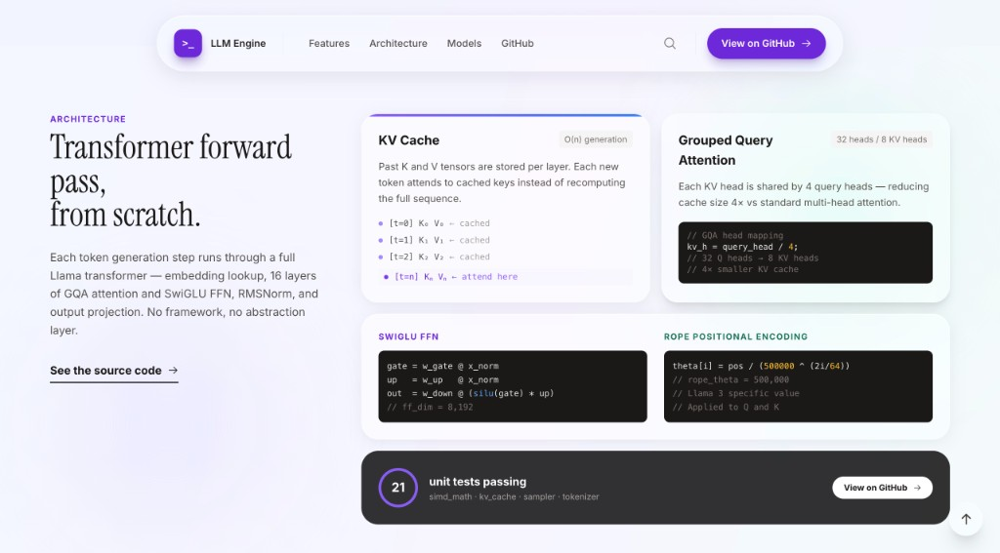
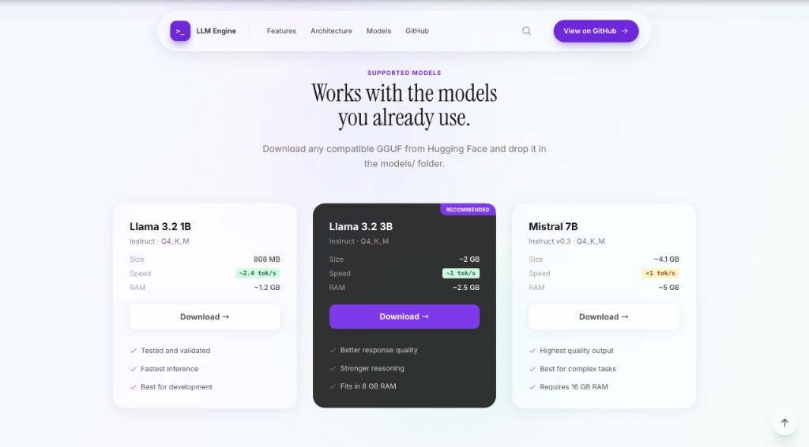
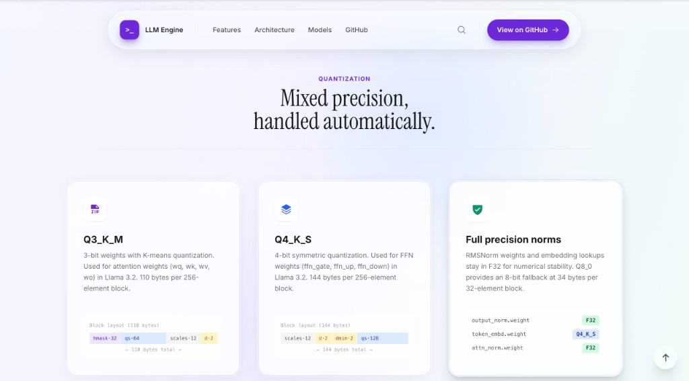
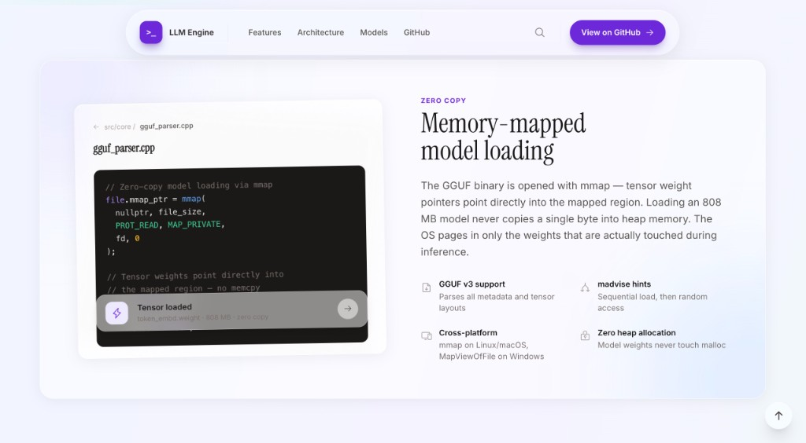

# LLM Engine

A C++ desktop application that runs local LLM inference entirely on CPU — no internet, no API keys, no cloud.

**Build:** Passing | **Platform:** macOS / Linux / Windows | **Language:** C++20 | **License:** MIT

---

## Screenshots

### Landing Page


### Desktop Chat UI


### Architecture


### Supported Models


### Quantization Formats


### Zero-Copy Model Loading


### Open Source CTA


---

## Features

- **Local inference** — runs entirely on CPU; no GPU required
- **GGUF format support** — loads Llama 3.2 and Mistral models directly
- **Mixed quantization** — supports Q3_K_M, Q4_K_S, Q4_K_M, Q8_0, and F32 weights
- **Memory-mapped loading** — multi-GB models load without copying weights into RAM
- **BPE tokenizer** — SentencePiece-compatible, loaded from GGUF metadata
- **KV cache** — O(n) generation via cached attention keys and values
- **Sampling** — greedy, temperature, top-k, top-p nucleus, repeat penalty
- **Streaming output** — tokens appear word by word as they are generated
- **Dear ImGui desktop UI** — native window, no browser or Electron
- **Threaded generation** — UI stays responsive while the model runs

---

## Architecture

LLM Engine is a from-scratch inference stack: GGUF parsing, tokenization, a transformer forward pass, sampling, and a Dear ImGui front end. **llama.cpp is not used as a runtime dependency** — the format is referenced for compatibility, but matmul, attention, dequantization, and generation are implemented in this repository.

### How it fits together

**GGUF loading.** When you open a `.gguf` file, the parser memory-maps the file read-only (`mmap` on Linux/macOS, `MapViewOfFile` on Windows). Metadata (architecture hyperparameters, tokenizer strings, merge scores) is parsed from the header. Tensor descriptors record name, shape, quantization type, and byte offset into the mapped region. At load time, the model **dequantizes weights into float buffers** for inference; tensor `data` pointers reference the mmap for parsing, while `Model` holds dequantized `std::vector<float>` weights used in `matvec` and attention.

**Tokenization.** The BPE tokenizer reads `tokenizer.ggml.tokens`, optional scores and token types, and BOS/EOS IDs from GGUF metadata. Text is split on spaces; each word is prefixed with the SentencePiece space marker `▁` (U+2581) and looked up as a whole token when possible, otherwise merged with BPE using vocabulary-derived pair scores. Byte-level fallback supports Llama 3 BYTE tokens in the vocabulary.

**Transformer forward pass.** For each token at position `pos`:

1. **Embedding** — index `token_embd` (with **weight tying**: `output.weight` falls back to `token_embd` when absent, as in Llama 3.2 1B).
2. For each of `N` layers:
   - **Attention** — RMSNorm → Q/K/V projections → **RoPE** on Q and K → write K/V into the **KV cache** at `pos` → grouped-query attention over positions `0..pos` → output projection → residual add.
   - **FFN** — RMSNorm → gate/up linear → **SwiGLU** (`silu(gate) * up`) → down projection → residual add.
3. Final RMSNorm → logits via output projection (tied or separate).

**KV cache.** Without caching, each new token would recompute keys and values for all prior positions, making total work **O(n²)** in sequence length. The cache stores per-layer K and V in flat buffers indexed by `[layer][position][kv_head][head_dim]`. Each step only computes Q/K/V for the new token and attends over cached K/V — **O(n)** per generated token.

**Sampling.** Raw logits pass through repeat penalty on recent context, temperature scaling, optional top-k masking, softmax, and top-p nucleus sampling (or greedy when temperature ≤ 0).

**UI threading.** Model load and text generation run on **worker threads**. Generated token strings append to a shared message list behind a **mutex**; the main thread reads that buffer every frame and renders with ImGui. An atomic **stop flag** lets the user cancel mid-generation.

### Directory layout

```
llm_engine/
├── include/core/       — engine headers
├── src/core/           — engine implementation
├── src/ui/             — Dear ImGui desktop app
├── tests/              — GoogleTest suite (21+ tests)
├── scripts/            — CLI smoke test, setup script
├── third_party/        — ImGui, GLFW (vendored)
└── models/             — place .gguf files here
```

---

## Supported Models

| Model | Size | Quantization | RAM Usage | Speed (Apple M-series) |
|-------|------|--------------|-----------|-------------------------|
| Llama 3.2 1B Instruct | 808 MB | Q4_K_M | ~1.2 GB | ~3 tok/s |
| Llama 3.2 3B Instruct | ~2 GB | Q4_K_M | ~2.5 GB | ~1 tok/s |
| Mistral 7B Instruct | ~4.1 GB | Q4_K_M | ~5 GB | est. &lt;1 tok/s |

*Speed figures are approximate on Apple Silicon in Release builds with scalar math paths. x86 builds can use AVX2 where available.*

---

## Build Instructions

### Prerequisites

- **CMake** ≥ 3.20
- **C++20 compiler** — GCC 11+, Clang 13+, or MSVC 2022
- **OpenGL** 3.3
- **Linux:** `libgl-dev`, `libx11-dev`, `libxrandr-dev`, `libxi-dev`

### Quick start

```bash
git clone https://github.com/fatinm1/LLM-Engine.git
cd LLM-Engine
git clone --depth=1 https://github.com/ocornut/imgui third_party/imgui
git clone --depth=1 https://github.com/glfw/glfw third_party/glfw
cmake -S . -B build -DCMAKE_BUILD_TYPE=Release
cmake --build build -j$(nproc)
```

Binaries:

- `build/llm_desktop` — desktop application (ImGui + GLFW)
- `build/tests/llm_tests` — unit tests

### macOS note

On **Apple Silicon**, the build does not use AVX2 (`-mavx2` is disabled automatically). All SIMD entry points in `simd_math` compile **scalar fallbacks** — this is expected and handled in CMake. Use **Release** for usable generation speed; Debug builds are much slower.

---

## Getting a Model

Download a GGUF checkpoint into `models/`:

```bash
# Using Hugging Face CLI
hf download bartowski/Llama-3.2-1B-Instruct-GGUF \
  Llama-3.2-1B-Instruct-Q4_K_M.gguf \
  --local-dir models/

# Or direct curl
curl -L \
  "https://huggingface.co/bartowski/Llama-3.2-1B-Instruct-GGUF/resolve/main/Llama-3.2-1B-Instruct-Q4_K_M.gguf" \
  -o models/Llama-3.2-1B-Instruct-Q4_K_M.gguf
```

Then launch the desktop app and load the file:

```bash
./build/llm_desktop
```

Use the model path field and **Load** (native file dialog planned in a future release).

---

## Running Tests

```bash
cd build && ctest -V
```

With a model file for integration tests that require a real GGUF:

```bash
export LLM_MODEL_PATH=models/Llama-3.2-1B-Instruct-Q4_K_M.gguf
ctest -R ModelTest -V
```

**Current status:** 21 tests passing (tokenizer integration test skips when `LLM_MODEL_PATH` is unset or the file is missing).

---

## CLI Smoke Test

Standalone binary (not wired into CMake) for quick parser/model checks:

```bash
c++ -std=c++20 -O3 -ffast-math \
    -I include \
    -o build/cli_test \
    scripts/cli_test.cpp \
    src/core/gguf_parser.cpp \
    src/core/tokenizer.cpp \
    src/core/model.cpp \
    src/core/kv_cache.cpp \
    src/core/sampler.cpp \
    src/core/simd_math.cpp

./build/cli_test models/Llama-3.2-1B-Instruct-Q4_K_M.gguf
```

Inspect GGUF structure without loading the full model:

```bash
c++ -std=c++20 -O2 -I include -o build/dump_gguf \
    scripts/dump_gguf.cpp src/core/gguf_parser.cpp src/core/simd_math.cpp

./build/dump_gguf models/Llama-3.2-1B-Instruct-Q4_K_M.gguf
```

---

## Technical Deep Dives

<details>
<summary><strong>Memory-mapped model loading</strong></summary>

GGUF files are opened with **`mmap(PROT_READ, MAP_PRIVATE)`** on Linux and macOS (and the equivalent Windows mapping APIs). The parser reads the header and tensor index from the mapped region, then sets each tensor’s `data` pointer to **`mmap_base + data_offset + tensor.offset`**. No bulk `memcpy` of the weight blob is required to parse the file.

The OS **demand-pages** data: physical RAM is touched only for bytes actually read during dequantization and inference. Opening an 808 MB file primarily costs **virtual address space** until the forward pass walks the weights. After parsing, the engine dequantizes tensors into float buffers for compute; the map remains the backing store for raw quantized bytes.

`madvise(MADV_SEQUENTIAL)` is used during header/tensor-index parsing; `MADV_RANDOM` is applied after load when scattered tensor access is expected.

</details>

<details>
<summary><strong>KV cache and why it matters</strong></summary>

Without a KV cache, generating token **N** would rerun the full transformer on all **N** tokens, and attention at each layer would recompute keys and values for every prior position. Total attention work scales as **1 + 2 + … + n = O(n²)** over a sequence.

With the cache, each layer stores **Key** and **Value** tensors for every position already processed. For a new token at position `pos`, the forward pass:

1. Computes Q, K, V only for the **current** token.
2. Writes K and V into `cache[layer][pos]`.
3. Computes attention scores as dot products between the current Q head and **cached** K vectors at positions `0..pos`.
4. Forms the output as a weighted sum over **cached** V vectors.

Past positions are never recomputed. Per-token work is **O(pos)** in context length; total generation is **O(n)** in sequence length for fixed model size.

**Memory layout:** two flat `std::vector<float>` buffers (K and V) indexed as:

`buffer[layer * layer_stride + pos * pos_stride + kv_head * head_dim + dim]`

with `pos_stride = n_kv_heads * head_dim` and `layer_stride = max_seq_len * pos_stride`.

</details>

<details>
<summary><strong>Grouped Query Attention (GQA)</strong></summary>

Llama 3.2 1B uses **32 query heads** but only **8 KV heads**. Each KV head is shared by **4** query heads; the **group ratio** is `GQ = n_heads / n_kv_heads = 4`.

Standard multi-head attention stores separate K and V for every query head. GQA stores one K/V pair per KV head and reuses it across the group, shrinking the **KV cache by 4×** with minimal quality loss on modern Llama architectures.

In code, for query head `h`:

```text
kv_h = h / GQ
```

Attention scores for head `h` use `K[layer][t][kv_h]` and the output mixes `V[layer][t][kv_h]` for all timesteps `t ≤ pos`.

</details>

<details>
<summary><strong>Quantization formats</strong></summary>

Weights in GGUF are stored in compressed blocks; the engine **dequantizes to float32** once at load time (per tensor) and runs inference in FP32.

**Q3_K_M (110 bytes / 256 elements)** — used heavily in Llama 3.2 1B layer weights:

| Region | Size | Role |
|--------|------|------|
| `hmask` | 32 B | High bit per element (1 bit × 256) |
| `qs` | 64 B | Low 2 bits per element (4 elements per byte) |
| `scales` | 12 B | 6-bit scales for 16 sub-blocks of 16 elements |
| `d` | 2 B | fp16 super-scale |

Per element `i`: combine low and high bits into a 3-bit value in `0..7`, center to `-4..3`, multiply by sub-block scale (6-bit unpacked from `scales`, centered by subtracting 32) and global `d`.

**Q4_K_S / Q4_K_M (144 bytes / 256 elements)** — super-block with fp16 `d` and `dmin`, 12 bytes of packed 6-bit scales, and nibble-packed 4-bit quants. Llama 3.2 may use **Q4_K_S (type 14)** for tensors such as `token_embd.weight` while **Q3_K_M (type 12)** dominates layer matrices — **mixed quantization** within one file.

**Q8_0 (34 bytes / 32 elements)** — fp16 scale plus 32 int8 values.

Unsupported types throw with the tensor name: `Model: unsupported quant type for tensor: …`

</details>

---

## Roadmap

- [ ] Refine tokenizer BPE merges for full Llama 3 tiktoken vocabulary parity
- [ ] Thread pool for parallel attention head computation
- [ ] Dear ImGui desktop UI with streaming chat window
- [ ] Native file dialog for model loading
- [ ] Chat template formatting (Llama 3 instruction format)
- [ ] Benchmark script (tokens/second across model sizes)
- [ ] AVX2 acceleration on x86 (scalar fallbacks currently used on Apple Silicon)
- [ ] Support for additional architectures (Phi-3, Gemma)

---

## License

MIT License

Copyright (c) 2025 Fatin Mojumder

Permission is hereby granted, free of charge, to any person obtaining a copy of this software and associated documentation files (the "Software"), to deal in the Software without restriction, including without limitation the rights to use, copy, modify, merge, publish, distribute, sublicense, and/or sell copies of the Software, and to permit persons to whom the Software is furnished to do so, subject to the following conditions:

The above copyright notice and this permission notice shall be included in all copies or substantial portions of the Software.

THE SOFTWARE IS PROVIDED "AS IS", WITHOUT WARRANTY OF ANY KIND, EXPRESS OR IMPLIED, INCLUDING BUT NOT LIMITED TO THE WARRANTIES OF MERCHANTABILITY, FITNESS FOR A PARTICULAR PURPOSE AND NONINFRINGEMENT. IN NO EVENT SHALL THE AUTHORS OR COPYRIGHT HOLDERS BE LIABLE FOR ANY CLAIM, DAMAGES OR OTHER LIABILITY, WHETHER IN AN ACTION OF CONTRACT, TORT OR OTHERWISE, ARISING FROM, OUT OF OR IN CONNECTION WITH THE SOFTWARE OR THE USE OR OTHER DEALINGS IN THE SOFTWARE.

---

## Acknowledgements

- **GGUF format** — Georgi Gerganov and the [llama.cpp](https://github.com/ggerganov/llama.cpp) project (format reference only; no llama.cpp inference code is linked or compiled into this project)
- **Dear ImGui** — Omar Cornut
- **GLFW** — the GLFW contributors
- **Models** — Meta AI (Llama 3.2), Mistral AI
